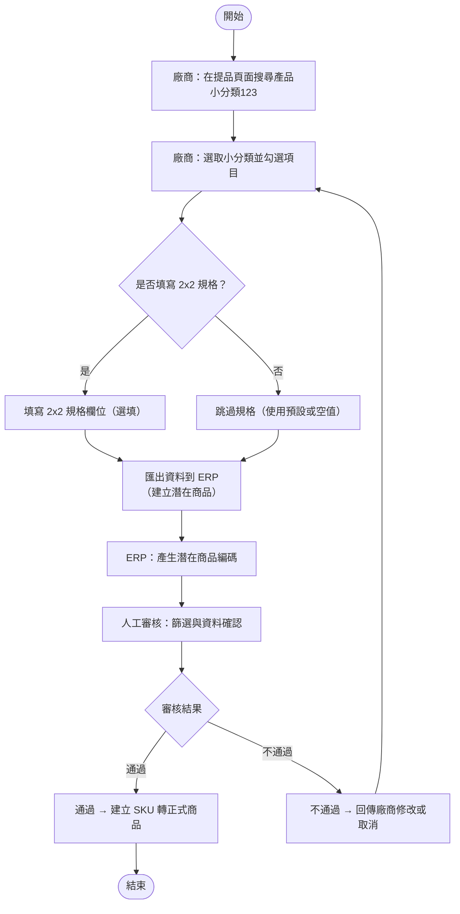

```mermaid
flowchart TD
  Start([開始])
  A[廠商：在提品頁面搜尋產品小分類123]
  B[廠商：選取小分類並勾選項目]
  C{是否填寫 2x2 規格？}
  D[填寫 2x2 規格欄位（選填）]
  E[跳過規格（使用預設或空值）]
  F[匯出資料到 ERP\n（建立潛在商品）]
  G[ERP：產生潛在商品編碼]
  H[人工審核：篩選與資料確認]
  I{審核結果}
  J[通過 → 建立 SKU 轉正式商品]
  K[不通過 → 回傳廠商修改或取消]
  End([結束])

  Start --> A --> B --> C
  C -->|是| D --> F
  C -->|否| E --> F
  F --> G --> H --> I
  I -->|通過| J --> End
  I -->|不通過| K --> B
```
